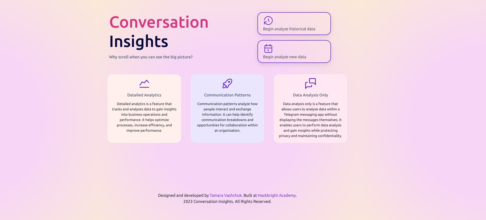
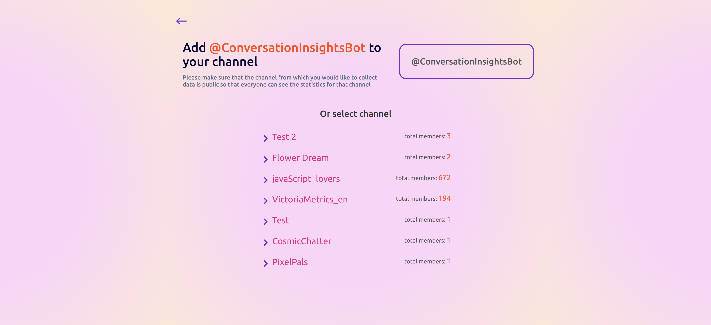
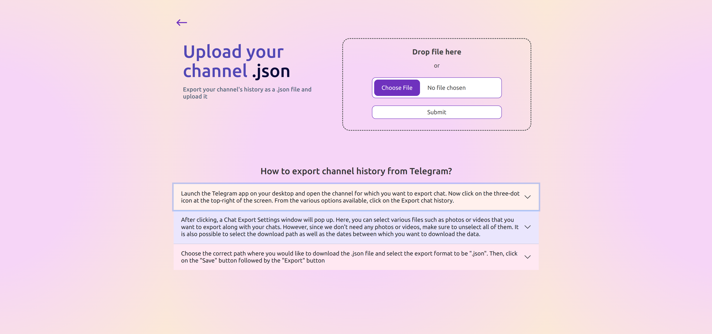
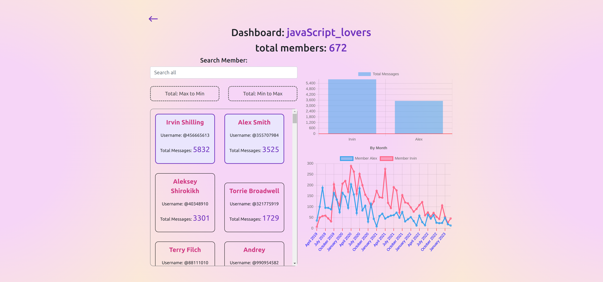

# Conversation Insights

#### A full-stack web application built in 4 weeks as Hackbright Fellowship final project.

The Conversation Insights is an initiative aimed at gathering insights and understanding trends from data collected
within the Telegram messaging platform. The project may involve the use of data analytics tools and techniques to
process and analyze large volumes of data, with the goal of identifying patterns, trends, and other useful information
that can inform decision-making or help improve the user experience on Telegram. Possible areas of analysis may include
user behavior, messaging frequency, demographics, and more. The insights gained from the project may be used to improve
the platform, develop new features, or inform marketing and advertising strategies.


## Table of Contents

* [Technologies Used](#technologiesused)
* [Features](#features)
* [Project Next Steps](#nextsteps)
* [Set up](#setup)
* [About Me](#author)

## <a name="technologiesused"></a>Technologies Used

* Backend: Python3, Flask, PostgreSQL, SQLAlchemy
* Frontend: React JS, Bootstrap, Jinja2, HTML5, CSS3
* APIs: Chart.js, Telegram API

## Features
**Demo Video:**

<a href="https://www.youtube.com/watch?feature=player_embedded&v=rgt0_Jm-muE"
target="_blank"></a>

Message frequency analysis: This feature could show users how frequently they send and receive messages, which could be
helpful for identifying patterns in messaging behavior and improving overall productivity.

User behavior insights: This feature shows who is the most active member of the chat.

Search: This feature helps navigate throught all members of chat and easy find them.







## <a name="nextsteps"></a>Project Next Steps

* Offer Project SLack using
* Schedule email notification.

## <a name="setup"></a>Set up
Clone or fork this repo:
```
git@github.com:aramattamara/Conversation-Insights.git
```
Create and activate a virtual environment inside your directory:
```
virtualenv env
source env/bin/activate
```
Install the dependencies:
```
pip install -r requirements.txt
```
Set up the database:
```
python3 seed_database.py
```
Run the app:
```
python3 server.py
```
Open up 'localhost:5000/' to access the app

## <a name="author"></a>About Me

Tamara is a software engineer originally from Ukraine, and currently living in CA. This is her first full stack
project. Visit my [LinkedIn](https://www.linkedin.com/in/tamara-vashchuk/)
